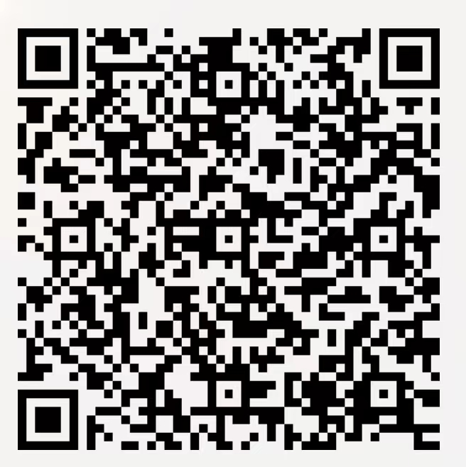

# Guide
A beginner-oriented learning guide repository.  
一份面向小白的学习指南。

## 社团
### 活动宗旨
HAUT AGI Club是一个最终目标致力于推广和研究达到人类同水平的通用人工智能技术的组织。我们希望为对人工智能感兴趣的同学提供一个良好的平台，让他们可以在这里深入学习、交流和实践相关技术。

我们定期举办技术分享会、编程训练营等活动，邀请行业内的专家和学者为社员们讲解最新的人工智能应用和发展趋势。此外，我们还鼓励社员们参与各种项目实践，培养他们的实战能力和团队合作精神。无论你是初学者还是已经有一定经验的人工智能爱好者，我们都会为你提供适合你的项目和实践机会。

在社团中，你不仅可以学到关于人工智能的知识和技能，还可以结交志同道合的朋友，共同探讨和解决问题。如果你对人工智能有兴趣，欢迎加入我们的社团，一起探索人工智能的无限可能

### 加入我们
  
QQ群二维码

## 仓库
感谢各位社团同学的辛苦持续贡献  
本仓库是一个面向人工智能初学者的学习指南，旨在帮助大家快速入门和掌握人工智能相关技术。在这里，你可以找到各种与人工智能相关的教程、实践项目、学习资源等，并且我们会不断更新和完善这些内容。

我们提供的学习资源包括但不限于机器学习、深度学习、自然语言处理、计算机视觉等方向的入门教程和进阶教程，以及各种常用的开发工具和框架的使用说明和示例项目。此外，我们还提供一些实践项目，让大家可以动手练习和巩固所学知识，并通过实践加深对人工智能技术的理解和应用。

### 文件夹结构
一个规划中的目录结构：
```
AI俱乐部仓库/
|-- 教程/
|   |-- Python基础/
|   |   |-- Python入门.ipynb
|   |   |-- Python条件语句和循环.ipynb
|   |   |-- Python函数.ipynb
|   |-- 机器学习/
|   |   |-- 线性回归.ipynb
|   |   |-- 决策树和随机森林.ipynb
|   |   |-- 聚类算法.ipynb
|   |-- 计算机视觉/
|   |   |-- 计算机视觉简介.ipynb
|   |   |-- 图像处理技术.ipynb
|   |   |-- 目标检测.ipynb
|-- 项目/
|   |-- 图像分类/
|   |   |-- image_classification.py
|   |   |-- README.md
|   |-- 情感分析/
|   |   |-- sentiment_analysis.py
|   |   |-- README.md
|-- 论文/
|   |-- 经典论文/
|   |   |-- 注意力机制全你要的.pdf
|   |   |-- 深度学习自然语言处理综述.pdf
|   |   |-- 对抗生成网络.pdf
|-- 资源/
|   |-- 书籍/
|   |   |-- Python数据科学手册.pdf
|   |   |-- TensorFlow深度学习框架.pdf
|   |-- 在线课程/
|   |   |-- Coursera - 机器学习/
|   |   |-- edX - 人工智能/
|-- 活动/
|   |-- 工作坊/
|   |   |-- TensorFlow工作坊2023/
|   |   |-- 计算机视觉工作坊2023/
|   |-- 嘉宾演讲系列/
|   |   |-- AI创新者演讲系列/
|   |   |-- README.md
|-- 贡献/
    |-- 代码/
    |   |-- 机器学习/
    |   |   |-- linear_regression.py
    |   |   |-- README.md
    |-- 笔记/
    |   |-- 机器学习/
    |   |   |-- 线性回归笔记.md
    |   |   |-- README.md
    |-- 教程/
        |-- 贡献教程/
        |-- README.md
```
（chatgpt给的参考）

## 其他
### 面向初学者的建议 
- 如果你是人工智能领域的初学者，我们建议你首先了解一些基本概念和常用算法。可以从数学基础、机器学习算法、深度学习模型、自然语言处理、计算机视觉等方面着手学习。

- 熟悉并熟练掌握一门编程语言是非常重要的，特别是 Python 语言。在学习过程中，我们建议你多看书、多练习，还可以通过在线课程和各种开源项目来加强自己的实践能力。

- 学习人工智能技术需要有耐心和毅力，因为它可能会比其他领域更具挑战性。尽管如此，我们鼓励大家保持对新技术的好奇心和热情，不断探索和尝试，这是成为一名成功的人工智能从业者所必须拥有的品质之一。

- 社区和论坛是一个非常好的资源，可以让你结交志同道合的朋友，分享知识和经验。同时，你也可以参加线上或线下举办的活动和比赛，这样可以让你更好地了解行业趋势，并提高自己的实践和竞争力。

想要成为一名优秀的人工智能从业者需要不断学习和实践。希望这个仓库中的学习资源和实践项目能够帮助你更好地入门和掌握相关技术，同时我们也欢迎你在社区中分享你的经验、问题、想法和项目成果！


### 面向进阶的建议
- 掌握更深入的数学知识：在深度学习的领域中，统计学和微积分等数学知识非常重要。所以我们建议您深入学习这些数学概念和技能，并了解更高级的算法和模型。

- 进一步探索先进的人工智能技术： 人工智能领域变化日新月异，例如 Diffusion、LLM、GAN、强化学习、迁移学习、多任务学习等都是目前比较流行的研究方向。努力探索这些新技术并将其应用到实际问题上，可以使你成为人工智能领域的专家。

- 深入研究开源代码实现： 尝试去阅读流行的机器学习框架的源代码（如PyTorch、Paddlepaddle）或其他优秀的开源项目。通过深入研究它们的代码实现，您可以获得更深入的理解和对事物的全局认识。

- 参加国内外相关会议和比赛：参加国际会议如CVPR、ICML等和相关竞赛如ImageNet、COCO等，可以让您更好地了解人工智能学术界和工业界的最新动态，结交志同道合的人，拓展自己的思路和视野。

进阶者需要不断深入学习和探索，保持好奇心和探究精神，同时不断实践和尝试，才能成为真正的人工智能专家。

### 在不同学习阶段的实践建议
 针对大一同学
- 尝试参加一些机器学习、数据挖掘等方面的入门课程和简单项目，并从中获得实践经验，例如参加 Kaggle 竞赛（playground上的大量易于入门的练习）
- 可以关注一些博客、论坛等社交媒体平台，向其他人工智能领域的爱好者请教，学习他们的方法和经验。
- 尝试掌握一门实用型的辅助开发技能，制作个人网站或mini-APP，为校内的网站或mini-APP贡献代码，参与与计算机科学相关的志愿者活动等

 针对大二同学
- 建议选择一个感兴趣的领域或问题，如计算机视觉或自然语言处理，并尝试找到相关的开源代码或数据集，通过实际运用所学知识进行练习和实践，尝试做成具体小的落地项目。
- 可以尝试参加一些寒暑假实习或者社区开源项目贡献活动，在实践中不断提高自己的技能和经验。

 针对大三及以上同学
- 建议尝试参加一些合作研究项目或专业的数据科学竞赛，并在其中发挥自己的创造性思维和创新精神。
- 可以选择撰写学术论文并提交到相关学术会议上，从而积累更丰富的研究经验（对简历有较大帮助），并与业内专家和同行交流互动。
- 经常关注arxiv上的进展也是一个不错的习惯。  
（chatgpt给的大学生学习人工智能建议参考）
